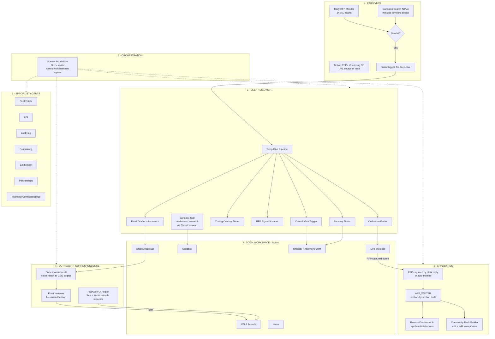
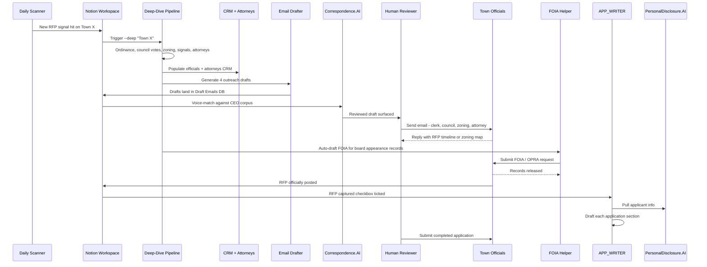
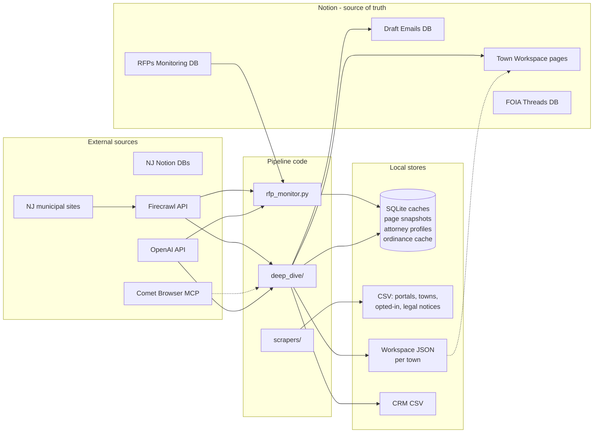
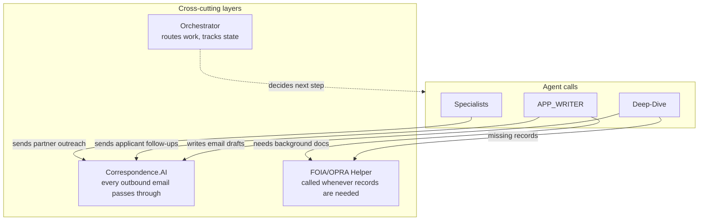
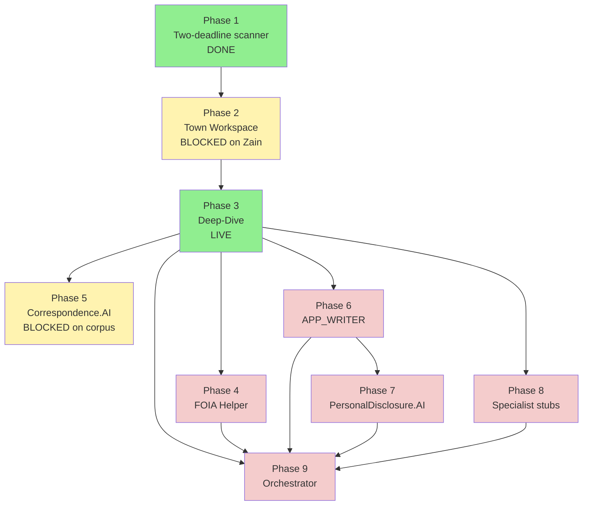

# License Acquisition Pipeline — Full Workflow

End-to-end view of how a cannabis retail license gets identified, researched, applied for, and won. Spans the daily NJ scanner through application submission, with every agent and data store called out.

## The big picture

## What is built today vs what is coming

| Phase | Component | Status |
|---|---|---|
| 1 | Two-deadline RFP scanner (`application_deadline` + `questions_deadline`) | DONE |
| 2 | Town Workspace in Notion | BLOCKED on Notion DB setup (Zain) |
| 3 | Deep-Dive — Ordinance Finder | LIVE |
| 3 | Deep-Dive — Council Vote Tagger | LIVE |
| 3 | Deep-Dive — Zoning Finder | LIVE |
| 3 | Deep-Dive — RFP Signal Scanner | LIVE |
| 3 | Deep-Dive — Attorney Finder | LIVE |
| 3 | Deep-Dive — Email Drafter | LIVE |
| 3 | Sandbox skill (Comet-powered research inside workspace) | PLANNED |
| 3 | Auto-FOIA on deep-dive completion | PLANNED |
| 4 | FOIA/OPRA Helper | NOT STARTED |
| 5 | Correspondence.AI (CEO voice match) | BLOCKED on email corpus |
| 6 | APP_WRITER | NOT STARTED |
| 7 | PersonalDisclosure.AI database + applicant form | NOT STARTED |
| 7 | Community Deck Builder | NOT STARTED |
| 8 | Specialist agent stubs (7 agents) | NOT STARTED |
| 9 | License Acquisition Orchestrator | NOT STARTED |

## End-to-end journey of a single license

## The data flow

## The agent layer (who does what)

| Agent / Skill | Role | When it fires | Status |
|---|---|---|---|
| **rfp-monitor** | Daily watcher across 344 NJ towns | Scheduled / on demand | LIVE |
| **cannabis-search-nj** | Keyword sweep of NJ municipal minutes | On demand or weekly | LIVE |
| **cannabis-search-va** | Same for Virginia | On demand | LIVE |
| **deep-dive** | Full single-town research (6 sub-tasks) | When a town hits or is manually flagged | LIVE |
| **Sandbox skill** | Ad-hoc research via Comet inside a workspace | Human asks a follow-up question in the town's sandbox | PLANNED |
| **Correspondence.AI** | Rewrites every outbound email in CEO's voice | Before any email is reviewed/sent | BLOCKED on corpus |
| **FOIA/OPRA Helper** | Drafts + submits records requests, tracks batches | Auto at deep-dive end, or on demand | NOT STARTED |
| **APP_WRITER** | Section-by-section application drafter | When RFP captured checkbox is ticked | NOT STARTED |
| **PersonalDisclosure.AI** | Applicant intake form + disclosure DB | Applicant clicks the login link | NOT STARTED |
| **Community Deck Builder** | Editable pitch deck per town | When prepping for council presentation | NOT STARTED |
| **Real Estate / LOI / Lobbying / Fundraising / Entitlement / Partnerships / Township Correspondence** | Domain specialists | Routed by orchestrator | NOT STARTED |
| **License Acquisition Orchestrator** | Routes work between agents based on workspace state | Always running | NOT STARTED |

## Cross-cutting concerns

## Risk controls baked into the pipeline

| Control | Where it applies | Why |
|---|---|---|
| Every LLM call has a regex / keyword fallback | All extraction steps | Pipeline runs end-to-end with no API key (degraded quality, but no hard dependency) |
| Every attorney needs at least one verifiable URL | Attorney finder | Prevents LLM hallucination of legal credentials |
| Verbatim name check before cannabis claim | Attorney finder | Attorney name must appear in source text |
| Town solicitor always excluded from recommendations | Attorney finder | Conflict of interest with town we are applying to |
| Workspace JSON saved after every sub-task | Deep-dive | A crash mid-run still leaves a usable artifact |
| All Notion writes are idempotent | Notion sync layer (when built) | Re-runs do not duplicate rows |
| FOIA letters are dry-run by default | FOIA helper (when built) | Human reviews before real submission |
| No automatic email sending | Correspondence.AI (when built) | Human-in-the-loop on every outbound message |

## Phase dependency graph

## Glossary

| Term | Meaning |
|---|---|
| **Class 5** | Adult-use cannabis retailer license (the target) |
| **Opt-in town** | Municipality that has passed an ordinance allowing cannabis retail. Not the same as having an active RFP. |
| **Moratorium** | Town has frozen new applications until a date. Tracked as a signal. |
| **RFP** | Request for Proposals — the formal application window. |
| **OPRA** | Open Public Records Act (NJ's FOIA equivalent) |
| **Friendly score** | Per-council-member metric: how receptive they are to cannabis retail. Drives Email Drafter's E2 recipient pick. |
| **Tier A/B/C** (attorneys) | A ≥70, B 40-69, C <40 on 0-90 scale. Only A+B reach `top_picks`. |
| **Verbatim check** | Attorney name must appear in source page text before any cannabis claim is accepted. |
| **Workspace** | Notion page per town with checklist, sandbox, CRM, emails, FOIA threads, notes. |

## What success looks like

1. Daily scanner spots a new RFP signal in **Town X**.
2. Town X gets a Notion workspace page auto-created.
3. Deep-dive runs in 3-8 minutes, fills out ordinance, council, zoning, attorneys, and queues 4 outreach emails.
4. Correspondence.AI voice-matches every email; human reviewer approves; emails go out.
5. FOIA Helper auto-files OPRA requests for board appearance records and zoning maps.
6. Town Clerk replies with RFP timeline. RFP captured checkbox ticked.
7. APP_WRITER drafts every section of the application using past examples.
8. Applicant fills PersonalDisclosure.AI form via a simple login link.
9. Community deck gets built with photos from a town visit, edited by the team.
10. Application submitted. Orchestrator advances workspace to "Submitted" state.
11. Subsequent town correspondence + lobbying + entitlement work routes through specialist agents.
