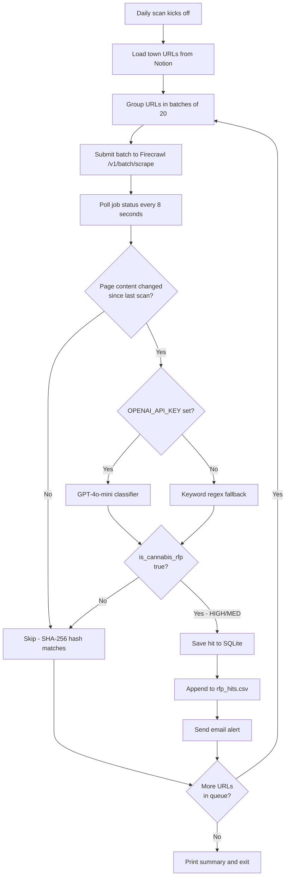

# RFP Monitor — Workflow

**What it does:** daily sweep of ~344 NJ municipal RFP / legal-notice pages for newly posted Class-5 (cannabis retail) license RFPs.

**Trigger phrases:** "check RFPs", "run the monitor", "scan towns", "first run"

## Inputs and outputs

| Input | Where it comes from |
|---|---|
| Town monitoring URLs | Notion RFPs Monitoring Database (344 towns, up to 6 URLs each) |
| API keys | `nj_rfp_monitor/.env` (`FIRECRAWL_API_KEY`, `NOTION_TOKEN`, `OPENAI_API_KEY`) |

| Output | Where it lands |
|---|---|
| RFP hits | `nj_rfp_monitor/hits/rfp_hits.csv` (appended per run) |
| Page snapshots | `nj_rfp_monitor/data/rfp_monitor.db` (SQLite) |
| First-run summary | `nj_rfp_monitor/data/first_run_summary.csv` (only with `--first-run`) |
| Email alerts | Sent to `ABBAS_EMAIL` if SMTP configured |

## Flow



## Run commands

```bash
# Full sweep (all 344 towns, ~18-45 min)
python nj_rfp_monitor/scripts/rfp_monitor.py

# Quick test (1 URL)
python nj_rfp_monitor/scripts/rfp_monitor.py --limit 1

# Single town
python nj_rfp_monitor/scripts/rfp_monitor.py --town "Vineland"

# Priority towns only (~20 hand-curated)
python nj_rfp_monitor/scripts/rfp_monitor.py --priority

# First-run summary mode
python nj_rfp_monitor/scripts/rfp_monitor.py --first-run
```

## How confidence works

| Level | Meaning | Action |
|---|---|---|
| HIGH | Live cannabis RFP almost certainly | Alert user with town, deadline, URL |
| MEDIUM | Likely RFP-related | Verify by opening URL |
| LOW | Weak signal (general ordinance, not RFP) | Logged, not alerted |
