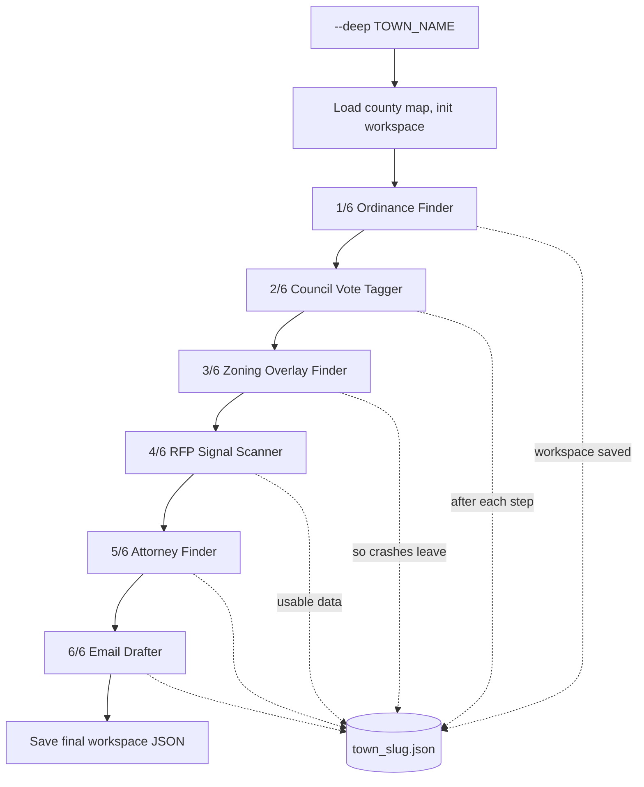

# Deep Dive — Workflow

**What it does:** comprehensive single-town research run. Six sub-tasks in sequence, saving after every one.

**Trigger phrases:** "deep dive Asbury Park", "research Vineland", "build the town workspace"

## Inputs and outputs

| Input | Where it comes from |
|---|---|
| Town name | CLI arg: `--deep "Town Name"` |
| County map | `nj_rfp_monitor/data/nj_opted_in_municipalities.csv` |
| Legal notice URL | `nj_rfp_monitor/data/nj_legal_notices.csv` |
| Officials contacts | `cannabis_hits/crm/cannabis_crm_enriched.csv` |

| Output | Where it lands |
|---|---|
| Workspace JSON | `nj_rfp_monitor/hits/deep_dives/<town_slug>.json` |
| Cached profiles | SQLite tables: `attorney_profiles` (30d), `town_attorneys` (7d), `ordinance_cache` (30d) |

## Flow



## Sub-task breakdown

```mermaid
flowchart TB
    subgraph S1["1/6 Ordinance Finder"]
        direction TB
        S1a[Check 30d SQLite cache] --> S1b{Cache hit?}
        S1b -->|Yes| S1z[Return cached ordinance]
        S1b -->|No| S1c[Firecrawl: ecode360.com search]
        S1c --> S1d[Firecrawl: library.municode.com]
        S1d --> S1e[Firecrawl: broad NJ ordinance query]
        S1e --> S1f[LLM extract 13 fields:<br/>number, adopted date, zones,<br/>cap, fees, buffers, hours, tax]
        S1f --> S1g[Score winner, cache, return]
    end

    subgraph S2["2/6 Council Vote Tagger"]
        direction TB
        S2a[Use adopted_date from S1] --> S2b[Search council minutes<br/>around adoption date]
        S2b --> S2c[Scrape meeting minutes PDF]
        S2c --> S2d[LLM extract roll-call vote:<br/>each member -> Yes/No/Abstain]
        S2d --> S2e[Cross-ref with CRM<br/>for roles + emails]
        S2e --> S2f[Compute friendly score<br/>per member]
    end

    subgraph S3["3/6 Zoning Finder"]
        direction TB
        S3a[Search town zoning page] --> S3b[Search for overlay map PDF]
        S3b --> S3c[Scrape candidate pages]
        S3c --> S3d[LLM extract confirmed zones<br/>+ overlay description]
        S3d --> S3e[Match against ordinance<br/>allowed_zones from S1]
    end

    subgraph S4["4/6 RFP Signal Scanner"]
        direction TB
        S4a[Search legal notices] --> S4b[Search bid aggregators:<br/>bidnetdirect, gov.deals, opengov]
        S4b --> S4c[Targeted news search:<br/>award, lawsuit, announcement]
        S4c --> S4d[LLM classify each hit:<br/>signal_type + confidence]
        S4d --> S4e[Cap math:<br/>ordinance cap vs awarded -><br/>open slots]
    end

    subgraph S5["5/6 Attorney Finder"]
        direction TB
        S5a[S1: Town solicitor<br/>excluded from picks]
        S5a --> S5b[S2: Planning Board minutes<br/>last 24mo]
        S5b --> S5c[S3: ZBA minutes]
        S5c --> S5d[S4: Council minutes<br/>reuses S2 cache]
        S5d --> S5e[S5: Legal notices<br/>applicant/attorney pairs]
        S5e --> S5f[S6: Per-attorney<br/>cannabis bonus search]
        S5f --> S5g[Dedupe by name + firm]
        S5g --> S5h[Score 0-90 -><br/>tier A/B/C]
    end

    subgraph S6["6/6 Email Drafter"]
        direction TB
        S6a[E1: Town Clerk<br/>when is the RFP?]
        S6b[E2: Friendliest Council<br/>relationship intro]
        S6c[E3: Zoning Officer<br/>confirm zones + map]
        S6d[E4: Top Attorney<br/>representation inquiry]
        S6a --> S6e[Each LLM call has<br/>plain-template fallback]
        S6b --> S6e
        S6c --> S6e
        S6d --> S6e
    end

    S1 --> S2
    S1 --> S3
    S2 --> S4
    S3 --> S4
    S4 --> S5
    S5 --> S6
```



## Run command

```bash
# Default run (3-8 min, uses caches when available)
python nj_rfp_monitor/scripts/rfp_monitor.py --deep "Asbury Park"

# Force re-search the ordinance (skip cache)
python nj_rfp_monitor/scripts/rfp_monitor.py --deep "Asbury Park" --refresh-ordinance
```

## What ends up in the workspace JSON

| Field | Source sub-task |
|---|---|
| `ordinance` | 13-field structured ordinance (number, adopted date, allowed zones, cap, fees, buffers, hours, tax) |
| `council_votes` | Roster tagged with vote (Yes/No/Abstain) + friendly score |
| `zoning` | Zoning overlay URL + confirmed retail zones |
| `rfp_signals` | RFP-imminent signals (legal notices, agenda mentions, news) |
| `attorneys.top_picks` | Top 1-3 attorneys, scored A (≥70) or B (40-69) |
| `attorneys.town_solicitor` | Town solicitor (excluded from picks - conflict of interest) |
| `draft_emails` | 4 outreach emails ready for human review |

## Key risk controls

| Control | Why it matters |
|---|---|
| No LLM-only attorney entries | Every attorney needs at least one verifiable source URL |
| Verbatim name check before cannabis claim | Attorney's name must appear in source page text or claim is dropped |
| Town solicitor always separated | Excluded from `top_picks` — would be a conflict of interest |
| Saved after every sub-task | A mid-run crash still leaves a usable artifact |
| All LLM calls have regex fallback | Pipeline runs end-to-end with no OpenAI key |
