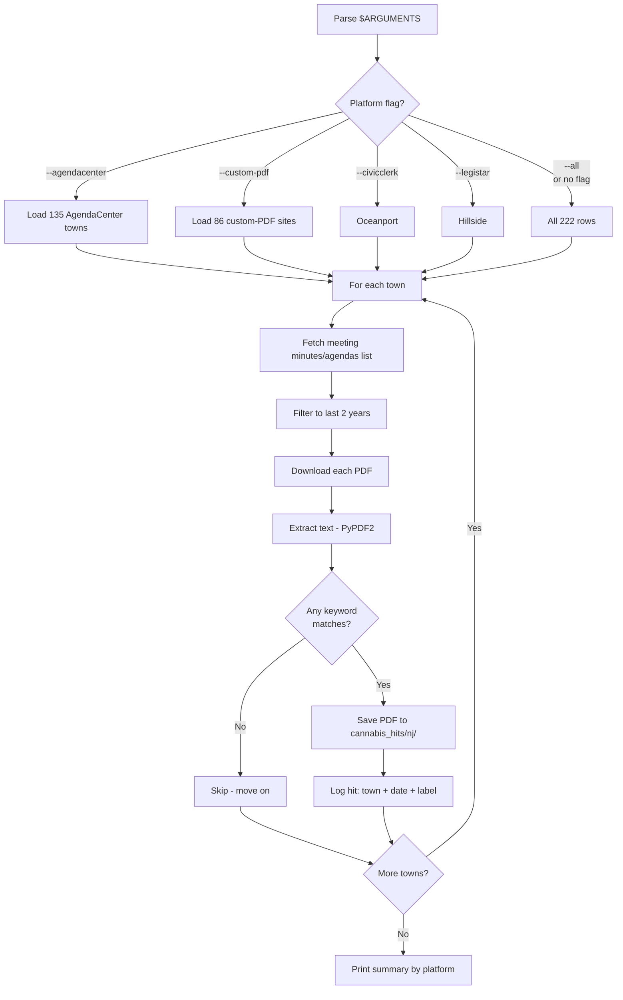

# Cannabis Search NJ — Workflow

**What it does:** keyword-search ~210 NJ municipal meeting-minutes portals for cannabis mentions.

**Trigger phrases:** "search NJ minutes", "scan agendas", "find cannabis discussions in NJ"

## Inputs and outputs

| Input | Where it comes from |
|---|---|
| Portal list | `nj_cannabis/data/nj_portals.csv` (375 NJ municipalities) |
| Keywords | Hardcoded: `cannabis`, `cannabis retail`, `dispensary`, `marijuana license` |
| Date window | 2 years rolling (NJ legalization is recent) |

| Output | Where it lands |
|---|---|
| Matching PDFs | `cannabis_hits/nj/` |
| Hit log | Console output + per-platform logs |

## Platform coverage

| Platform | Rows | Example towns |
|---|---|---|
| `--agendacenter` | 135 | Edison, Toms River, Asbury Park, Cherry Hill, Westfield |
| `--custom-pdf` | 86 | Bayonne, Sayreville, Robbinsville, Marlboro |
| `--civicclerk` | 1 | Oceanport |
| `--legistar` | 1 | Hillside |

**Total covered:** 222 rows across 5 platforms.

## Flow



## Run commands

```bash
# All platforms
python -m scrapers.nj --all

# Just AgendaCenter (largest bucket, fastest)
python -m scrapers.nj --agendacenter

# Single town
python -m scrapers.nj --agendacenter --city "toms river"

# Custom-PDF sites
python -m scrapers.nj --custom-pdf
```

## Platform detection (for adding new towns)

```bash
# Sweep unknown towns to fingerprint their portal type
python -m scrapers.nj.detect_platform --workers 25

# Retry timed-out detections
python -m scrapers.nj.retry_timeouts

# Deep sweep for stubborn unknowns (35 paths per town + link following)
python -m scrapers.nj.deep_sweep --workers 20
```

## Known hits from previous runs

| Town | County | Platform | Docs | Notes |
|---|---|---|---|---|
| Stockton Borough | Hunterdon | custom_pdf | 9 | Active RFP/RFA with scoring rubric + 8 addenda |
| Haddon Township | Camden | custom_pdf | 21 | Agendas + minutes + planning board |
| Florence Township | Burlington | custom_pdf | 5 | Regular meetings Nov 2025 to Apr 2026 |

## Adding a new municipality

1. Add the town to `nj_cannabis/data/nj_portals.csv` with a `detected_platform` value.
2. Re-run. No code changes needed.
