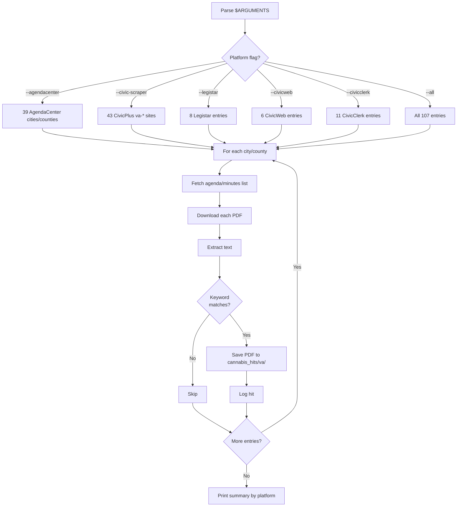

# Cannabis Search VA — Workflow

**What it does:** keyword-search ~107 Virginia municipal meeting-minutes portals for cannabis mentions.

**Trigger phrases:** "search VA minutes", "scan Virginia agendas", "find cannabis discussions in VA"

## Inputs and outputs

| Input | Where it comes from |
|---|---|
| City configs | `scrapers/va/config.py` |
| Keywords | Hardcoded: `cannabis`, `cannabis retail`, `dispensary`, `marijuana license` |

| Output | Where it lands |
|---|---|
| Matching PDFs | `cannabis_hits/va/` |
| Hit log | Console output |

## Platform coverage

| Platform | Count | Notable entries |
|---|---|---|
| `--agendacenter` | 39 | Norfolk, Chesapeake, Charlottesville, Lynchburg, Fredericksburg, Williamsburg, Bristol, plus 24 counties |
| `--civic-scraper` | 43 | All `va-*.civicplus.com` CivicPlus sites (Bedford through York County) |
| `--legistar` | 8 | Richmond, Alexandria, Hampton, Harrisonburg, Albemarle County, Vienna, Brunswick County, Petersburg |
| `--civicweb` | 6 | Williamsburg, Winchester, Newport News, Lancaster County, Lexington, Northampton County |
| `--civicclerk` | 11 | Petersburg, Danville, plus 9 counties (Amherst, Augusta, Bedford, Frederick, Greene, Isle of Wight, James City, Mathews, Scott) |

**Total coverage:** ~107 entries across 5 platforms.

## Flow



## Run commands

```bash
# All platforms
python -m scrapers.va --all

# Just AgendaCenter
python -m scrapers.va --agendacenter

# Single city
python -m scrapers.va --legistar --city "richmond"

# CivicPlus va-* sites
python -m scrapers.va --civic-scraper
```

## Known issues

| Site | Issue |
|---|---|
| Essex County | HTTP 522 (intermittent Cloudflare timeout) |
| Norton | Connection reset by remote host (intermittent) |

## Differences vs NJ

| Aspect | NJ | VA |
|---|---|---|
| Date window | 2 years | Longer (VA legalization is older) |
| Total coverage | 222 rows | ~107 entries |
| Largest platform | AgendaCenter (135) | civic-scraper (43) |
| Custom-PDF sites | 86 | Folded into civic-scraper/civicplus |
| Platform detection tools | Yes (`detect_platform`, `deep_sweep`) | No |
